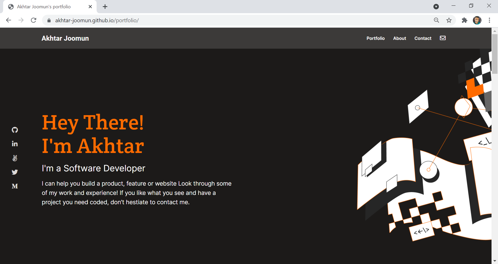

# Portfolio: setup and mobile version skeleton
  Building the first page of my portfolio using Flexbox

## Built With
- HTML
- CSS

## Getting Started
To get a local copy up and running follow these simple example steps.

- Clone this repository with: git clone `https://github.com/Ak0706/portfolio-skeleton.git` using your terminal or command line.
- Change to the project directory by entering :  
  `cd portfolio-skeleton` in the terminal .

### Setup
Make sure the files are in the same folder.

## Authors

👤 **Akhtar Joomun**
- GitHub: [@githubhandle](https://github.com/Ak0706)
- Twitter: [@twitterhandle](https://twitter.com/Akhtar54272024)
- LinkedIn: [LinkedIn](https://www.linkedin.com/in/akhtar-joomun-0b86021b8/)

## Acknowledgments
- Hat tip to anyone whose code was used
- Inspiration

## 🤝 Contributing
Contributions, issues, and feature requests are welcome!
Feel free to check the [issues page](../../issues/).

## Show your support
Give a ⭐️ if you like this project!

## :memo: License
This project is [MIT](https://choosealicense.com/licenses/mit/) licensed.
